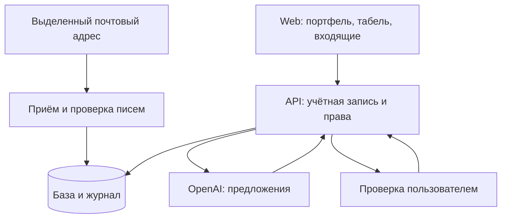

# Project Pulse: архитектура продукта

Состояние: v30, 24 сентября 2026. Это переход от локальной демонстрации к продукту для совместной работы. Сервер AI подготовлен в коде; существующие проекты, HR, ставки и табель пока хранятся в браузере. Подключение AI само по себе не превращает их в общую защищённую базу.

## Что покупает CEO

Основной сценарий: увидеть отклонение → проверить источник → выбрать действие → назначить ответственного и срок → проверить исполнение и изменение прогноза. Письма и голос уменьшают затраты на сбор данных. HR поддерживает ресурсное планирование; сам по себе набор HR-полей не доказывает ценность подписки.

| Пользователь | Основная задача | Первый экран и ожидаемый результат |
|---|---|---|
| CEO | Защитить деньги и исполнение | Три решения с причиной, влиянием, ответственным, сроком и свежестью исходных данных |
| Руководитель | Устранить отклонение | Свой дивизион, просроченные подтверждения, загрузка с учётом отсутствий |
| Координатор | Обновить прогноз проекта | Входящие сообщения, предложенные изменения, этапы, трудозатраты и остаток работ |
| Специалист | Отчитаться с минимумом ввода | Своя неделя: сказать проект, день, часы и результат; проверить; отправить |
| Бухгалтер / договорной специалист | Сверить деньги и обязательства | Договор, выставленный счёт, поступление и расхождения как отдельные сущности |

## Текущая и целевая система

Для текущего масштаба (40 сотрудников, 30 проектов) достаточно модульного монолита. Не нужны отдельные сервисы для каждого экрана. Модули: Identity, Portfolio, Workforce, Finance, Inbox, Decisions, Audit и AI Gateway. Их доменные правила должны быть отделены от DOM и от провайдера AI.

| Слой | Реализовано в v30 | Следующий производственный этап |
|---|---|---|
| Web | Существующий React build, отдельные доменные функции, RU/EN, локальные черновики | Восстановить исходный React/TypeScript проект и обычную сборку; убрать ручную правку скомпилированного bundle |
| Identity | Для нового API: проверяемый JWT Cloudflare Access, серверный список пользователей | Организации, приглашения, управляемые роли и отзыв доступа; убрать демопереключатель из production |
| Portfolio / Workforce | Локальные проекты, HR, табель, ставки, бюджеты | Перенести записи на API, добавить версии и миграцию существующего localStorage с предварительным просмотром |
| Inbox | D1: письма, дедупликация, версии, ручная привязка, отмена, аудит | Фоновая очередь, повторные попытки, карантин и операционный мониторинг; при необходимости OAuth Gmail/Graph |
| AI | Responses API со строгой JSON Schema и отдельная транскрипция | Оценка на размеченных примерах клиента; выбор модели по точности, стоимости и задержке |
| Finance | Раздельно показаны часы, трудовая стоимость и платежи | Подрядчики, командировки, прочие затраты, прогноз остатка работ и сверка с бухгалтерией |
| Audit | Локальный журнал; серверный журнал входящих и вызовов AI | Единая история всех бизнес-изменений; ссылки на источники, восстановление, экспорт |

Cloudflare Worker + D1 выбран как небольшой подготовленный серверный контур. При переходе к сложной отчётности, интеграциям и большим объёмам можно перенести Repository на Postgres, сохранив API и доменные правила.

## Правила данных

1. `tenant_id` определяется проверенной серверной учётной записью. Клиент не выбирает организацию, права или автора записи.
2. Доступ к проектам берётся из `project_members`, CEO видит проекты своей организации. Для API остальные роли получают явные назначения. Доступ руководителя к дивизиону должен материализоваться в эти назначения при администрировании.
3. Ставка фиксируется при отправке часов; изменение справочника не пересчитывает историю. Возврат и повторная отправка — отдельное событие с явной политикой ставки.
4. Черновик, отправленная запись и утверждённая запись различаются. Принятый результат не выводится только из количества часов.
5. Billable-часы — классификация работы. Выручка по фиксированному договору не равна `часы × внутренняя ставка`.
6. Нужны две разные оценки: предварительная трудовая стоимость по отправленным часам и подтверждённая стоимость по принятым. Текущий EAC по объектам — экстраполяция труда, а не полный прогноз прибыли.
7. Серверные обновления используют версию записи. Повтор доставки не создаёт вторую сущность. Отмена создаёт событие и не затирает более позднюю версию.

Целевая модель: `tenant → users, divisions, projects`; у проекта — contracts, stages, milestones, costs, memberships; у сотрудника — rates с периодом действия, absences, bookings; у timesheet_entry — автор, дата, минуты, проект, категория, статус, snapshot ставки; отдельно deliverable/acceptance, email/source, proposal, decision и audit_event. Денежные величины хранить в минимальных единицах валюты, трудозатраты — в целых минутах. Внешние расчёты не должны использовать двоичную дробь для денег.

## Поток писем

Выделенный адрес → MIME-разбор → проверка размера → ключ дедупликации → карантин → входящие владельца → AI по явному действию → проект и категория как предложение → ручное подтверждение → журнал.

Ключ учитывает организацию, Message-ID, отправителя, тему и нормализованный текст. Один Message-ID с изменённым содержимым не считается тем же письмом. Доверенный список отправителей помогает маршрутизации, но не доказывает подлинность адреса; все письма Email Worker остаются в карантине до просмотра. HTML отображается текстом, вложения не исполняются и не передаются модели.

Код проекта в теме имеет приоритет. Неизвестный код или несколько кодов не заменяются догадкой. Без кода проект всегда предлагается для проверки; ниже 0,70 сопоставление пустое. Число confidence — эвристика модели, не статистическая гарантия. Даже выше 0,90 требуется подтверждение.

AI не имеет инструментов изменения договора, денег, владельца, дат или статуса. Текст письма находится в пользовательском входе модели и объявлен недоверенными данными. Структурный ответ проверяется ещё раз на сервере; чужой projectId отклоняется.

## Поток голосового табеля

Запись до 60 секунд / загрузка файла → транскрипция → исходный текст → структурированное предложение → выбор недостающего дня/проекта → редактируемый черновик → существующая отправка руководителю.

Запись идёт только после нажатия. Закрытие окна и смена профиля останавливают микрофон и отменяют ожидающий результат. Аудио не сохраняется нашим сервером. Неназванные часы и даты не придумываются; трудозатраты по неделе не распределяются автоматически. Негативные и условные фразы не являются выполненной работой. Успех AI не означает автоматическое утверждение табеля.

Новый API сверяет реальную учётную запись с выбранным профилем. Результат в v30 добавляется в локальный черновик после проверки; совместное серверное согласование табеля ещё не реализовано.

## Следующие улучшения по приоритету

| Приоритет | Улучшение | Проверяемый критерий |
|---|---|---|
| P0 | Общая база, роли, миграция и резервное восстановление | Два пользователя работают с одним проектом; конфликт не теряет запись; восстановление из копии проверено |
| P0 | Источник, автор, дата и полнота каждого управленческого показателя | CEO видит, какие часы не сданы и какой прогноз не подтверждён |
| P1 | Полная экономика и остаток работ | Прогноз труда + прочие затраты сверяется с договором; допущения видны отдельно |
| P1 | Решения CEO и контроль исполнения | Решение имеет владельца, срок, статус, подтверждение исполнения и финансовый эффект |
| P1 | Качество AI на собственных фразах и письмах | Размеченные RU/EN сценарии; измеряются неверная привязка, потерянные часы, доля ручной правки |
| P2 | Почтовая очередь, OAuth, наблюдаемость | Есть задержка обработки, причины отказов, повторная попытка и лимит затрат на организацию |

До продажи подписки провести пилот на нескольких реальных проектах: время обновления данных, сверка экономики, найденные заранее отклонения, принятые решения. Критерии и исходные значения согласуются до пилота. Количество графиков и AI-запросов не заменяет доказанный эффект.
